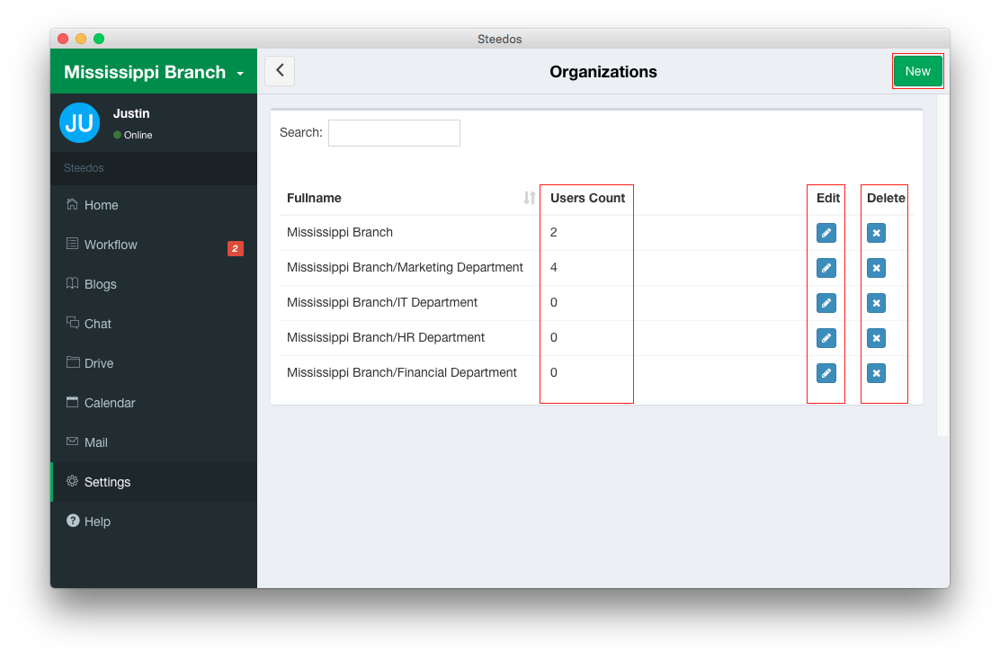

## Organization settings

In Steedos Workflow，space admins should finish settings previously, including organization settings, user settings and flow role settings. Here comes to organization settings.

You can establish a multi-tiered corporate structure in Steeods Workflow. Enter the workspace and click on “Workflow”. Then click on “Organization”, and you can do more settings.

  - Create a new organization
      - Root organization. After entering the interface, click the “New” button. Then enter its name to create the root organization.
      - Sub-organization. When organization A select organization B as Parent, A becomes the sub-organization of B.
  - Edit an organization
      - Click on “Edit” button of the organization, and then you can edit the “Name” and “Parent” of it.
  - Delete an organization 
      - Click on “Delete” button of the organization, and then confirm to delete and finish the steps.
      - An organization cannot be deleted if it has sub-organizations. You need delete all sub-organizations previously.

