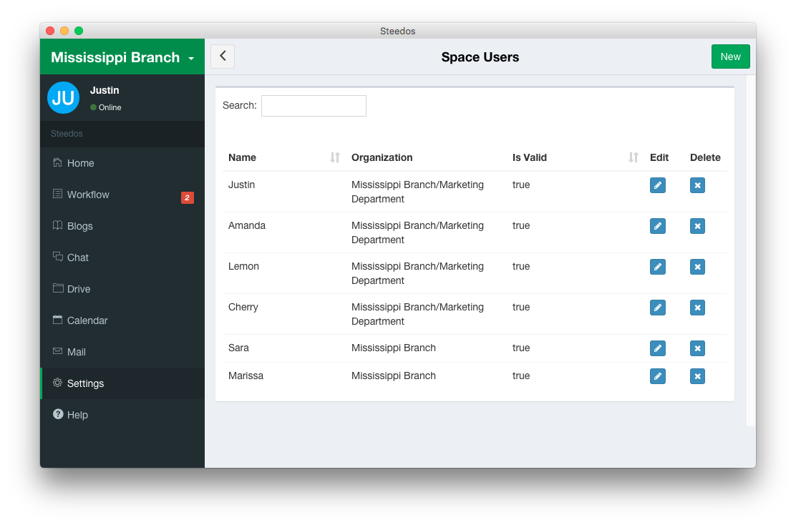

## User Settings

Here comes to space user settings.
- Enter the workspace.
- then click “Settings”. 
- Next, click on “Space users”. 

In the pop-up interface, you can do more settings.

#### Add a new user
- Click the “New” button.
- Enter user’s name, email address, parent organizations and manager.
- Click “Create”.

#### Edit user’s information
- Click the “Edit” button of the space users.
- And then you can modify name, organization and manager if necessary.

#### Delete a user
- Click the “Delete” button in the lists of the user.
- Then confirm to delete it.

####NOTICE
The new added account is valid by default. You can tick the selection box to disable it if necessary.
