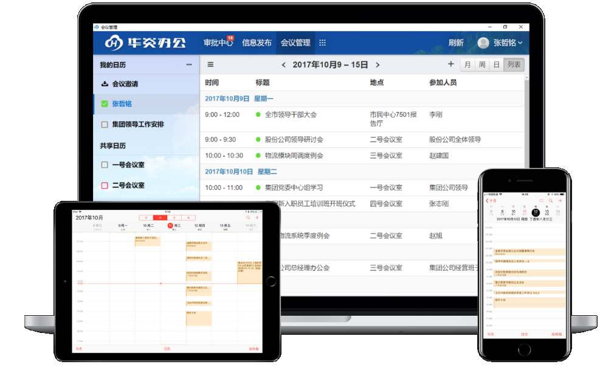

## 手机同步
 华炎会议管理系统支持同步到手机系统自带的日历上，您即使不装我们软件的手机版也能随时随地同步到最新的数据。而且这种同步是双向的，您在PC上使用本软件对日历和会议做的修改，会立刻同步到您的手机上，当然您也可以在手机自带的日历软件上对日历和会议做修改，同样会同步到我们的日历软件上。具体操作如下：
 - 苹果手机同步
     - 设置->账户和密码->添加账户->其他->添加CalDav账户。
     	注：iphone6以下的型号，在日历->账号->添加账户->其他->添加CalDav账户
     - 输入服务器地址[https://cn.steedos.com](https://cn.steedos.com)，用户名和密码。
     - 点击下一步，连接上服务器，将日历和会议同步到您的设备上即可。
 - 安卓手机同步
     - 腾讯应用宝下载第三方软件"sol日历"
     - 设置->添加其他日历账户->用户自定义
     - 输入服务器地址[https://cn.steedos.com/dav](https://cn.steedos.com/dav)，用户名和密码。
     - 确定之后，会将日历和会议同步到您的设备上。
 
 注：此功能是专业版功能，需要购买会议管理专业版才能使用，目前可免费试用。

   