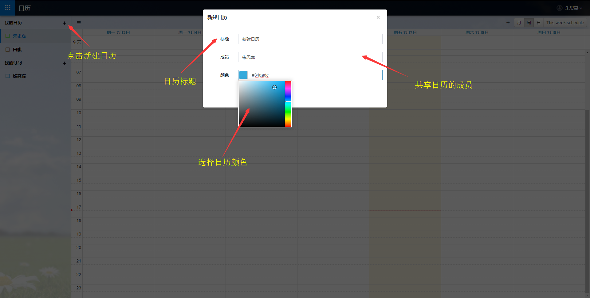
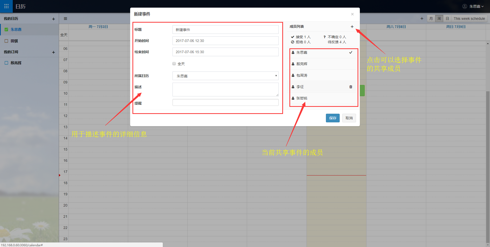

# 华炎日历

### 华炎日历概述
华炎日历是以日历为基础，面向公司，组织和事业单位,用于合理安排日程，使用会议室等资源的办公软件。

- 您可以轻松地查看到公司的会议室安排，从而选择空闲的会议室进行会议。
- 您可以为自己所需要参加的会议设置提醒时间，不必再担心自己会因为忙碌而错过会议。
- 您可以自由地添加日历，在每个日历上进行不同的日程安排，每个日程安排都能邀请其他人参与进来，查看他们的反馈情况。并且您也可以将自己的日历分享给其他人，或者订阅他人的日历。
- 无需连接手机，您就能将您的日程安排同步到您的移动设备上，随时随地进行查看。

接下来就为您介绍华炎云日历的使用方法。

## 导航栏
- [登录及主界面](quickguide.md#登录及主界面)
- [新建日历](quickguide.md#新建日历)
- [日历设置](quickguide.md#日历设置)
- [新建事件](quickguide.md#新建事件)
- [共享事件及日历](quickguide.md#共享事件及日历)
    - [共享事件](quickguide.md#共享事件)
    - [共享日历](quickguide.md#共享日历)
- [删除事件](quickguide.md#删除事件)
- [日历同步](quickguide.md#日历同步)
    - [苹果设备](quickguide.md#苹果设备)
    - [安卓设备](quickguide.md#安卓设备)

### 登录及主界面
登录 (https://cn.steedos.com/calendar) ，输入您的华炎账号和密码即可以进入华炎日历主界面

当您第一次进入华炎日历时，系统会为您新建一个以您用户名称命名的日历，您可以根据您的喜好使用或修改该日历。

日历主界面整体分为两个部分，左侧的侧边栏用于对日历的操作，剩余的部分则是日历视图部分，用户可以查看时间和操作日程安排。

日历侧边栏包含了以下的模块：
- 我的日历——该模块显示了您账户下新建的日历和其他用户分享给您的日历。
- 我的订阅——该模块显示了您所订阅用户的日历。
- 日历选择——您可以选择一个日历，然后您在日历视图部分上新建的日程安排就会记录在当前日历上。
- 日历勾选——每个日历的左侧都会有一个小方框。您可以点击这个小方框来勾选日历，这样，右侧的日历视图部分就会显示您当前勾选日历上存在的日程安排。
- 日历操作——每个日历的右侧都隐藏有一个小图标，当您将鼠标移入到您想操作的日历上时，右侧的小图标就会显示出来，通过点击图标，会出现一个小菜单栏，里面对应有您可以进行的操作。
    - 编辑日历：您可以修改日历的信息，包括标题，成员，颜色。
    - 删除日历：您可以删除您不需要的日历。
    - 查看详情：对于他人分享给您的日历，您可以查看日历的详细信息，但您不可以对其进行修改，而如果是您订阅的日历，您可以修改日历的颜色。
    - 取消订阅：您可以删除您所订阅的日历

日历视图部分包含了以下模块：
- 视图切换——日历的视图分为四种：月，周，日和本周安排，您可以通过点击右上角的四个按钮进行视图切换。
- 新建事件——您可以在日历视图上新建事件，以此来安排您的日程
    
### 新建日历
新建一个日历的具体流程如下：

1. 在日历侧边栏“我的日历”标题的右侧，有一个显示为“+”的按钮，当您点击这个按钮后，屏幕中央就会出现一个弹出框。
1. 在弹出框的标题输入框中，输入您想要给该日历的命名，如“本周会议安排”。
1. 为您的日历选择成员，默认的成员只有您本人，如果您想要将日历分享给他人，就点击成员输入框，然后勾选上您想要分享的人。
1. 为您的日历添加颜色，点击颜色输入框，会出现一个选色盘，您可以在选色盘中拖动鼠标，从而选择一个您想要的颜色。
1. 在完成上述信息的输入之后，点击保存，一个属于您的新建日历就完成了。

### 订阅日历
您可以订阅同事的日历，更重要的是你可以订阅会议室的日历。
订阅日历的具体流程如下：

1. 在日历侧边栏“我的订阅”标题的右侧，有一个显示为“+”的按钮，当您点击这个按钮后，屏幕中央就会出现一个弹出框。
1. 您可以在弹出框中勾选你想要订阅的同事或者会议室的名称，点击确认之后，您就可以获取到他们的日历了。

### 共享日历
您可以在新建日历或者编辑日历的时候，点击成员输入框，然后勾选上您想要分享的人，保存之后，您所勾选的成员就会获取到您的这个日历，也会获取到您在日历上新建的事件，但是他们只能查看事件的详细信息，而不能对事件进行修改。
与订阅日历不同的是，任何共享日历上的成员，都可以在该日历上新建事件，而新建的事件也可以被所有成员查看。

### 新建事件

- 当您的日历视图处在“月”时，您可以通过点击日期从而获取新建事件的弹出框；当您的日历视图处在“周”或“日”时，您可以先点击视图以此来确定一个时间点，然后拖动鼠标到另一个时间点，从而获取到新建事件的弹出框；而在“本周安排”视图下，您是无法通过点击视图来新建事件的。
- 在新建事件的弹出框中，有如下几个字段：
    - 标题：标题字段的默认值为“新建事件”，您可以给事件标题重新命名。
    - 开始时间：代表事件的开始时间，您也可以重新选择开始时间。
    - 结束时间：代表事件的结束时间，您也可以重新选择结束时间。 
    - 全天：当你勾选上全天选项时，事件的开始时间和结束时间就会自动发生变化，时间间隔变为1天。
    - 所属日历：当您拥有多个日历时，您可以选择在所属日历字段中进行日历切换，这样，新建的事件就会属于您所选择的日历。
    - 描述：您可以对该事件进行描述，当您邀请他人参与的时候，别人也能对这个事件有所了解。
    - 提醒：在提醒字段，您可以选择事件的提醒时间，在到达提醒时间时，系统会提醒您事件将要发生。
- 在新建事件的弹出框中，有一个成员列表，用于邀请其他人参与您的这项事件，您可以通过点击“成员列表”标题右侧的“+”按钮，获取可选成员的弹出框，然后勾选上你想要邀请的成员，点击确认之后，您所邀请的人就会出现在成员列表中。
- 在完成上述信息的录入之后，点击保存，事件就会保存下来，您可以在事件相对应的日历视图上看到此事件，同时，被邀请者成员的默认日历上，也可以看到此事件。

### 修改事件

当您已经在日历上新建完事件之后，您可以在相应的日历视图上看到该事件，当您再次点击该事件时，可以获取到事件信息弹出框，您可以看到事件的详细信息，并且可以对其中的内容进行修改。当您完成修改之后，点击保存，该事件修改后的信息就会保存下来。

### 共享事件

在您新建事件或者修改事件时，都能在弹出框中看到成员列表，用于邀请其他人参与您的这项事件，而凡是被您邀请的人，都会出现在成员列表中，相应的，您的这个事件也就变成了共享事件，在您成员列表中的成员，都能在他们自己的默认日历视图中看到此事件。当他们点击此事件后，所获取的弹出框中会多出一个是否参加字段，可以选择“接收”，“不确定”或者“拒绝”，也可以在备注信息框中输入相应的信息。当他们完成信息的录入之后，您就可以在成员列表中看到他们的回复状态和备注信息了。
对于受到邀请的成员来说，他们还能对事件的提醒时间进行修改，以便更好的安排自己的工作，而为了保证事件其他详细信息的准确性，他们是无权进行修改的。

### 删除事件

对于已经存在于日历视图上的事件，您可以通过点击该事件，从而获取事件信息的弹出框，在弹出框的右下角有“删除”按钮，只需要点击该按钮，事件就会被删除了。

### 日历同步
#### 苹果设备
同步日历至苹果设备的具体流程如下：

- 点击打开您的苹果设备的设置，在设置界面点击日历，再点击“添加账户”。

- 进入账户添加界面后，选择“其他”作为账户类型。然后再选择日历模块的“添加CalDAV账户”。之后输入华炎日历的服务器地址（cn.steedos.com/dav/）与您华炎日历平台的用户名与密码。 
            
=============================

#### 安卓设备
- 安卓设备进入应用商店下载并安装“Sol日历”。
 
============================

- 打开Sol日历，点击左上角菜单，再点击右上角的设置按钮，点击添加其他日历账户，选择用户自定义。
- 在服务器登入地址界面内，输入华炎日历的服务器地址（cn.steedos.com/dav/）与您华炎日历平台的用户名与密码。   

=============================

