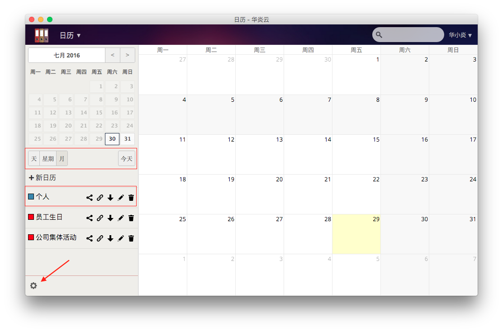
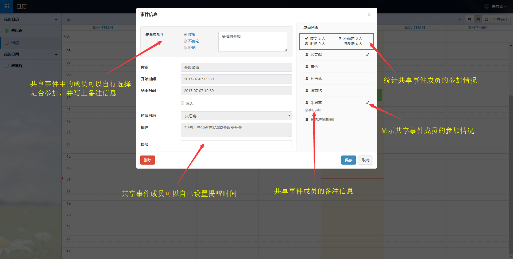
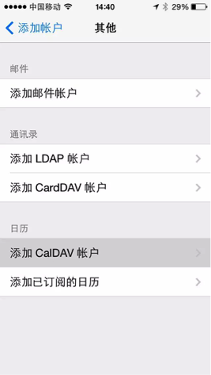
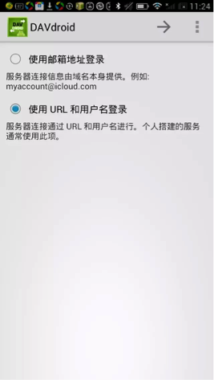

# 华炎云日历
华炎云日历是上海华炎软件公司开发的云日历。在华炎云日历中，您可以创建与编辑事件，将事件与其他日历同步，以及创建新的个性化日历等。

接下来为您简要介绍一下华炎云日历的使用方法。

## 导航栏
- [登录及主界面](quickguide.md#登录及主界面)
- [新建日历](quickguide.md#新建日历)
- [日历设置](quickguide.md#日历设置)
- [新建事件](quickguide.md#新建事件)
- [共享事件](quickguide.md#共享事件)
- [导入导出日历及事件](quickguide.md#导入导出日历及事件)
- [删除事件](quickguide.md#删除事件)
- [日历同步](quickguide.md#日历同步)
    - [苹果设备](quickguide.md#苹果设备)
    - [安卓设备](quickguide.md#安卓设备)

### 登录及主界面
登录进入华炎云平台，点击左侧控制面板中的 “日历”，即可进入华炎云盘日历主界面。

在默认情况下，当您第一次进入华炎云盘日历，您将会获得一个名为“个人”的日历，您可以根据您的喜好使用或修改该日历。

日历主界面包含了以下的模块：
- 日历日期——该模块自动显示了当前的日期。您可以在该模块上选择一个您想查看的日期。
- 日历浏览格式——您可以选择以天、星期、或月的格式在主界面上浏览您的日历。此外该模块最右侧的“今天”按钮可以让您的日历显示的日期直接弹回到今天。
- 日历选择——您可以选择一个想浏览的日历。
- 日历控制——您可以对某个特定的日历进行控制。这些控制包括了共享日历、CalDav链接、下载、编辑、以及删除等。
- 日历设置——点击日历左下角的设置图标，能够对日历进行多项设置，包括设置时区、时间格式、一周开始于、主要的CalDAV地址、以及iOs/OS X CalDAV地址等。

### 新建日历
新建一个日历的具体流程如下：

1. 在日历主界面侧上方的“+新日历”，系统将会在该位置上弹出一个对话框。
1. 在新弹出的对话框上对您的新建日历命名,如“国家法定节假日”。
1. 为您的新建日历选取一个颜色
1. 点击对话框最后侧的蓝色勾选框，完成新日历的创建。

### 日历设置
华炎云盘日历设置提供了全球的配置，您所创建的所有日历均可以根据其所在地区的当地时区来设置相应的日历时间。在日历设置模块内，您可以更改以下内容：
- 时区：时区内依照不同大洲来分类，并根据首字母排列顺序提供所有国家的名称列表。您可以选择一个时区作为您的日历的时区。
- 时间格式：您可以选择12时制也可以选择24时制。
- 一周开始于：提供一周开始于的日期选项包括周六、周日、和周一。
- 主要的CalDAV地址： 提供了主要的CalDAV地址链接。
- iOS/ OS X CalDAV 地址：提供了iOS/ OS X CalDAV 地址链接。

### 新建事件
您可以在日历上新建事件，具体的操作流程如下：

1. 当您的日历浏览处在“天”或者“周”时，您可以直接点击右侧界面的某个时间点来创建事件。当您的日历浏览处在“月”时，您可以点击右侧界面的某一天来新建事件。以下以当您的日历浏览处在“月”时为例演示新建事件过程。
1. 双击右侧界面具体某一天，在弹出的对话框中输入事件名称。
1. 当您有多个日历时，您可以为事件选择一个日历。
1. 为您的事件设定一个具体的日期。当您的事件被设定为全天事件时，您无法再设定该事件的具体时间跨国。当您取消全天事件前的勾选框打钩时，您即可为您的事件设定具体的发生时间跨度。
1. 您可以选择去点击高级选项，填写事件发生地点、类别、以及对事件的简要描述。
1. 点击对话框顶部的“重复”按钮，进入重复对话框设置，以设置您的事件是否需要重复。在默认的情况下，事件是设定为不重复的。您可以将事件的重复频率设定更改为每天、每周、每个工作日、每月、每年。
1. 点击“重复”对话框里的“高级”按钮，您还可以为您所选的重复频率设置高级功能。系统会针对不同的重复频率提供不同的选项以便更好地定义您的重复需求。
1. 点击“创建新事件”完成新事件的创建。

### 共享事件
当创建完事件，再点击进入您所创建的事件，则可以对该事件进行编辑与修改。此外，在弹出的对话框上，还额外增加了一个“共享”标栏。

在共享标栏对话框内包括了以下的选项：
- 分享给其他用户或组——您可以指定您想将该事件分享的用户和组。
- 好友是否可见——您可以设定您所共享的信息的共享程度，共享的程度包括了显示完整事件、仅显示繁忙、隐藏事件。
    - 显示完整事件——将事件的所有细节均展示给所分享的用户和组。
    - 仅显示繁忙——仅当您在该事件繁忙时显示，不显示事件具体细节。
    - 隐藏事件——对指定的用户和组隐藏事件。

共享一个事件的流程为：

1. 指定用户或组以共享您的事件。
1. 定义您的事件对用户或组的共享程度。
1. 点击“发送邮件”以通过邮件方式共享您的事件细节。
1. 点击“保存事件”按钮保存您的修改。保存完毕后，对话窗口将自动关闭。

### 导入导出日历及事件
您可以将在华炎云日历上的单一事件或整个日历导至其他日历。

导出单一事件的步骤如下：

1. 在日历的流程界面上找到某一事件。
1. 双击该事件，弹出设置该事件的对话窗口。
1. 点击高级选项，在窗口的底部将出现一个“导出事件”按钮。
1. 点击“导出事件”按钮，将事件导出至您的计算机上。完成单一事件的导出。

导出整个日历的步骤如下：

1. 点击某个您需要导出的日历名称后面的下载图标，选择保存的路径。
1. 再点击“下载”即可完成日历的导出。

### 删除事件
1. 在日历界面上点击右侧界面的某个您想删除的具体事件。进入事件编辑对话窗口。
1. 在编辑事件对话窗口的左下角有一个“删除事件”图标，点击该图标，即可删除事件。

### 日历同步
#### 苹果设备
同步日历至苹果设备的具体流程如下：

- 点击打开您的苹果设备的设置，进入设置界面。在设置界面上选择“邮件、通讯录、日历”。再点击选择添加账户。

- 进入账户添加界面后，选择“其他”作为账户类型。然后在选择日历模块的“添加CalDAV账户”。之后输入华炎云盘的服务器地址（cn.steedos.com/drive/）与您华炎云平台的用户名与密码。 
            

- 选择一个或多个您苹果设备上的App与您所导入的日历同步。点击“存储”完成日历的同步。如下图中由于选取了与“提醒事项”同步，故而当你打开您的苹果设备的“提醒事项”App时，您将看到您所同步的日历。     

#### 安卓设备
- 在安卓应用市场下载并安装“DAVdroid”。
- 在安卓设备的“设置”界面上找到“添加账户”选项。点击进入添加账户界面后，选择“DAVdroid”.进入新的界面后，选择“使用URL和用户名登入”，并点击“下一步”。
      
 

- 在服务器登入地址界面内，输入您的华炎云盘的服务器地址（Drive.steedos.com/remote.php/carddav/principals/用户名）与您的华炎云盘用户名和密码，完成后，点击 “下一步”。
- 您可以选择需要您同步的内容。再点击 “下一步”，进入账户信息界面。您可以重新命名您的账户显示名。点击 “完成”，完成华炎云盘与您的安卓设备的日历同步的设置。

