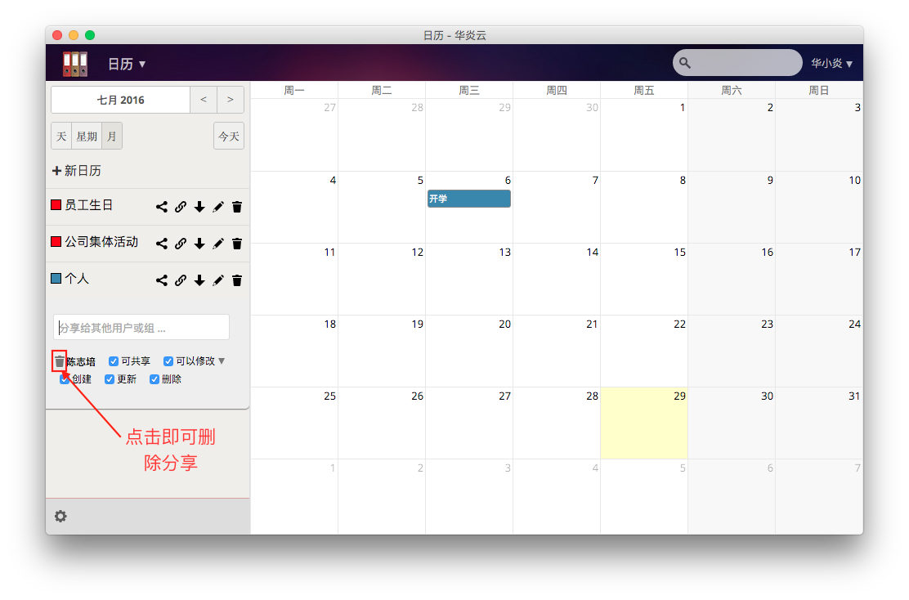
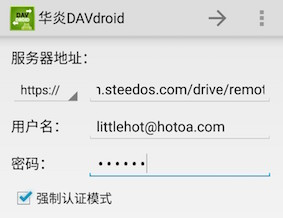

# 华炎日历

### 华炎日历概述
华炎日历是以日历为基础，面向公司，组织和事业单位,用于合理安排日程，使用会议室等资源的办公软件。

- 您可以轻松地查看到公司的会议室安排，从而选择空闲的会议室进行会议。
- 您可以为自己所需要参加的会议设置提醒时间，不必再担心自己会因为忙碌而错过会议。
- 您可以自由地添加日历，在每个日历上进行不同的日程安排，每个日程安排都能邀请其他人参与进来，查看他们的反馈情况。并且您也可以将自己的日历分享给其他人，或者订阅他人的日历。
- 无需连接手机，您就能将您的日程安排同步到您的移动设备上，随时随地进行查看。

接下来就为您介绍华炎云日历的使用方法。

## 导航栏
- [登录及主界面](quickguide.md#登录及主界面)
- [新建日历](quickguide.md#新建日历)
- [日历设置](quickguide.md#日历设置)
- [新建事件](quickguide.md#新建事件)
- [共享事件及日历](quickguide.md#共享事件及日历)
    - [共享事件](quickguide.md#共享事件)
    - [共享日历](quickguide.md#共享日历)
- [删除事件](quickguide.md#删除事件)
- [日历同步](quickguide.md#日历同步)
    - [苹果设备](quickguide.md#苹果设备)
    - [安卓设备](quickguide.md#安卓设备)

### 登录及主界面
登录 (https://cn.steedos.com/calendar) ，即可以进入华炎日历主界面

当您第一次进入华炎日历时，系统会为您新建一个以您用户名称命名的日历，您可以根据您的喜好使用或修改该日历。

日历主界面整体分为两个部分，左侧的侧边栏用于对日历的操作，剩余的部分则是日历视图部分，用户可以查看时间和操作日程安排。

日历侧边栏包含了以下的模块：
- 我的日历——该模块显示了您账户下新建的日历和其他用户分享给您的日历。
- 我的订阅——该模块显示了您所订阅用户的日历。
- 日历选择——您可以选择一个日历，然后您在日历视图部分上新建的日程安排就会记录在当前日历上。
- 日历勾选——每个日历的左侧都会有一个小方框。您可以点击这个小方框来勾选日历，这样，右侧的日历视图部分就会显示您当前勾选日历上存在的日程安排。
- 日历操作——每个日历的右侧都隐藏有一个小图标，当您将鼠标移入到您想操作的日历上时，右侧的小图标就会显示出来，通过点击图标，会出现一个小菜单栏，里面对应有您可以进行的操作。
    - 编辑日历：您可以修改日历的信息，包括标题，成员，颜色。
    - 删除日历：您可以删除您不需要的日历。
    - 查看详情：对于他人分享给您的日历，您可以查看日历的详细信息，但您不可以对其进行修改，而如果是您订阅的日历，您可以修改日历的颜色。
    - 取消订阅：您可以删除您所订阅的日历

日历视图部分包含了以下模块：
- 视图切换——日历的视图分为四种：月，周，日和本周安排，您可以通过点击右上角的四个按钮进行视图切换。
- 新建事件——您可以在日历视图上新建事件，以此来安排您的日程
    
### 新建日历
新建一个日历的具体流程如下：

1. 在日历侧边栏“我的日历”标题的右侧，有一个显示为“+”的按钮，当您点击这个按钮后，屏幕中央就会出现一个弹出框。
1. 在弹出框的标题输入框中，输入您想要给该日历的命名，如“本周会议安排”。
1. 为您的日历选择成员，默认的成员只有您本人，如果您想要将日历分享给他人，就点击成员输入框，然后勾选上您想要分享的人。
1. 为您的日历添加颜色，点击颜色输入框，会出现一个选色盘，您可以在选色盘中拖动鼠标，从而选择一个您想要的颜色。
1. 在完成上述信息的输入之后，点击保存，一个属于您的新建日历就完成了。

### 订阅日历
您可以订阅同事的日历，更重要的是你可以订阅会议室的日历。
订阅日历的具体流程如下：

1. 在日历侧边栏“我的订阅”标题的右侧，有一个显示为“+”的按钮，当您点击这个按钮后，屏幕中央就会出现一个弹出框。
1. 您可以在弹出框中勾选你想要订阅的同事或者会议室的名称，点击确认之后，您就可以获取到他们的日历了。

### 新建事件

- 当您的日历视图处在“月”时，您可以通过点击日期从而获取新建事件的弹出框；当您的日历视图处在“周”或“日”时，您可以先点击视图以此来确定一个时间点，然后拖动鼠标到另一个时间点，从而获取到新建事件的弹出框；而在“本周安排”视图下，您是无法通过点击视图来新建事件的。
- 在新建事件的弹出框中，有如下几个字段：
    - 标题：标题字段的默认值为“新建事件”，您可以给事件标题重新命名。
    - 开始时间：代表事件的开始时间，您也可以重新选择开始时间。
    - 结束时间：代表事件的结束时间，您也可以重新选择结束时间。 
    - 全天：当你勾选上全天选项时，事件的开始时间和结束时间就会自动发生变化，时间间隔变为1天。
    - 所属日历：当您拥有多个日历时，您可以选择在所属日历字段中进行日历切换，这样，新建的事件就会属于您所选择的日历。
    - 描述：您可以对该事件进行描述，当您邀请他人参与的时候，别人也能对这个事件有所了解。
    - 提醒：在提醒字段，您可以选择事件的提醒时间，在到达提醒时间时，系统会提醒您事件将要发生。
- 在新建时间的弹出框中，有一个成员列表，您可以通过点击“成员列表”标题右侧的“+”按钮，获取可选成员的弹出框
1. 当您有多个日历时，您可以为事件选择一个日历。
1. 为您的事件设定一个具体的日期。当您的事件被设定为全天事件时，您无法再设定该事件的具体时间跨度。当您取消全天事件前的勾选框打钩时，您即可为您的事件设定具体的发生时间跨度。
1. 您可以选择去点击高级选项，填写事件发生地点、类别、以及对事件的简要描述。
1. 点击对话框顶部的“重复”按钮，进入重复对话框设置，以设置您的事件是否需要重复。在默认的情况下，事件是设定为不重复的。您可以将事件的重复频率设定更改为每天、每周、每个工作日、每月、每年。
1. 点击“重复”对话框里的“高级”按钮，您还可以为您所选的重复频率设置高级功能。系统会针对不同的重复频率提供不同的选项以便更好地定义您的重复需求。
1. 点击“创建新事件”完成新事件的创建。

### 共享事件及日历
#### 共享事件
当创建完事件，再点击进入您所创建的事件，则可以对该事件进行编辑与修改。此外，在弹出的对话框上，还额外增加了一个“共享”标栏。

================

在共享标栏对话框内包括了以下的选项：
- 分享给其他用户或组——您可以指定您想将该事件分享的用户或组。
- 好友是否可见——您可以设定您所共享的信息的共享程度，共享的程度包括了显示完整事件、仅显示繁忙、隐藏事件。
    - 显示完整事件——将事件的所有细节均展示给所分享的用户和组。
    - 仅显示繁忙——仅当您在该事件繁忙时显示，不显示事件具体细节。
    - 隐藏事件——对指定的用户和组隐藏事件。

共享一个事件的流程为：

1. 指定用户或组以共享您的事件。
1. 定义您的事件对用户或组的共享程度。
1. 点击“发送邮件”以通过邮件方式共享您的事件细节。
1. 点击“保存事件”按钮保存您的修改。保存完毕后，对话窗口将自动关闭。

#### 共享日历
此外您还可以共享整个日历，在主界面左侧某个日历后面有“共享标志”与“链接标志”。

- 分享标志。点击分享标志，可以选择分享给用户或用户组。选择用户后还可进行权限设置。
    - 可共享；
    - 可以修改（创建，更新，删除）；
    - 您还可以删除分享（点击分享账户前的删除图标即可）。
- 链接标志。点击链接标志，可将CalDav链接分享给好友。

### 删除事件
1. 在日历界面上点击右侧界面的某个您想删除的具体事件，进入事件编辑对话窗口。
1. 在编辑事件对话窗口的左下角有一个“删除事件”图标，点击该图标，即可删除事件。

### 日历同步
#### 苹果设备
同步日历至苹果设备的具体流程如下：

- 点击打开您的苹果设备的设置，进入设置界面。在设置界面上选择“邮件、通讯录、日历”。再点击“选择添加账户”。

- 进入账户添加界面后，选择“其他”作为账户类型。然后在选择日历模块的“添加CalDAV账户”。之后输入华炎云盘的服务器地址（cn.steedos.com/drive/）与您华炎云平台的用户名与密码。 
            
=============================

- 选择一个或多个您苹果设备上的App与您所导入的日历同步。点击“存储”完成日历的同步。

#### 安卓设备
- 点击链接 http://oss.steedos.com/apps/calendar/android/SteedOS-DAVdroid.apk 或者扫描下方二维码，下载并安装“华炎DAVdroid”。
 
============================

- 在安卓设备的“设置”界面上找到“添加账户”选项。点击进入“添加账户”界面后，选择“华炎DAVdroid”.
- 在服务器登入地址界面内，输入您的华炎云盘的服务器地址（cn.steedos.com/drive/remote.php/caldav/principals/用户名）与您的华炎云盘用户名和密码，完成后，点击 “下一步”。  

=============================

- 您可以选择需要您同步的内容。再点击 “下一步”，进入账户信息界面。您可以重新命名您的账户显示名。点击 “完成”，完成华炎云盘与您的安卓设备的日历同步的设置。
