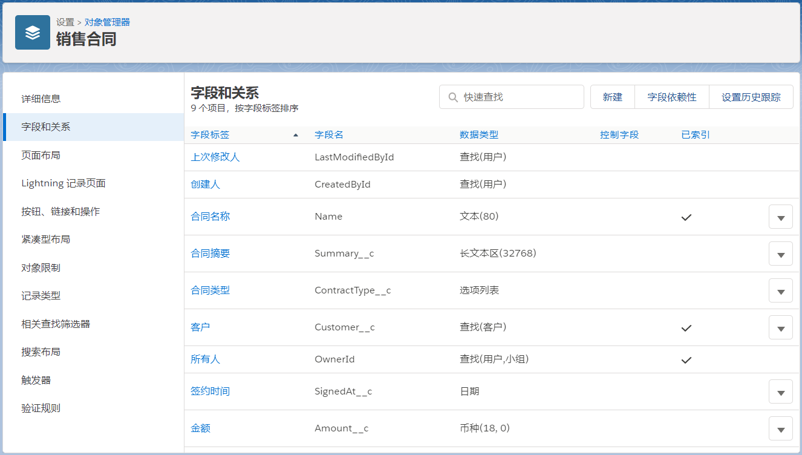

# Steedos Creator
Creator是企业级的应用软件开发平台，帮助客户快速开发功能丰富，权限细致的企业级应用系统。
- 零代码快速开发手机、平板、电脑三合一的应用系统；
- 配置化界面，可按照客户需求随时调整系统功能；
- 企业级的权限设计，精确控制数据权限。

例如，如果业务部门提出需求要开发一套合同管理系统，IT部门只需要做如下操作：
- 设定合同表及相关字段；
- 设定合同付款信息表及相关字段。

您将获得一套功能完整的合同管理系统，包括：
- [列表视图](listview.md)；
- [记录视图](record.md)；
- [编辑视图](edit.md)；
- 平板客户端界面；
- 手机客户端界面；
- 授权用户可以方便的检索数据并保存过滤条件；
- 完善的权限控制，可以精确控制不同用户对不同字段的访问权限；
- [用户可创建自定义报表、二维表、图表进行统计分析](./reports.md)；
- 与Excel建立数据连接，利用Excel进行实时统计分析；
- 系统内置组织结构、人员管理、应用管理、权限管理等用户管理功能；
- 系统内置附件管理功能，可以管理具体的合同的附件以及每一个版本；
- 系统内置审批功能，可以针对具体的合同或者付款情况进行审批；
- 系统内置任务管理功能，可以针对具体的合同或者付款情况创建待办任务；
- 系统内置讨论功能，可以针对具体的合同或者付款情况进行讨论和回复；
- 系统内置修改痕迹追踪功能，可追踪具体用户对具体字段的变更情况；
- 提供回收站功能，对于误删除的记录可以恢复；
- 可以从Excel导入数据；
- 字段可以随时按照业务部门的需求进行调整；
- 对于选择型字段，管理员可以随时配置可选项；
- 系统自动生成基于ODATA协议的API，方便与第三方系统集成；
- 我们的团队还在持续开发许多创新的新功能，敬请期待。

如果您的业务部门还提出了更多细节的功能要求，我们还提供进一步的脚本配置功能
- triggers，定义当数据增、删、改时自动触发执行对应的脚本；
- actions，定义用户界面上显示的操作按钮以及触发的脚本。
