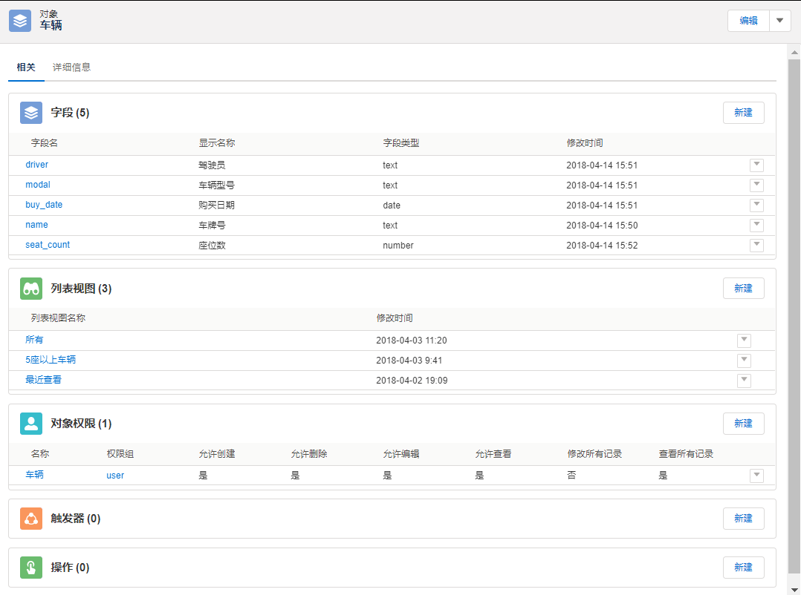

# Steedos Creator
Creator是华炎创新研发的新一代开发平台，帮助客户零代码快速开发企业级业务系统。

### 问题的提出
- 对于业务部门的业务需求，IT部门通常寻求软件公司定制开发，定制开发必然面临周期长、费用高的问题
- 随着智能手机的普及，业务系统开发也有移动化的需求，定制成本更高
- 因为开发商不同，每个系统的界面、操作习惯各有不同
- 子系统开发的越来越多，每个子系统都需要安排维护人员，当部门、人员有调整时，需要逐个子系统排查

### Creator的解决方案
- 只需在界面上进行简单配置，即可自动生成全功能的业务系统
- 自动生成电脑、平板、手机、Excel客户端
- 当客户需求发生变化时，简单修改配置，就能快速调整系统功能
- 企业级的权限设计，可精确控制业务数据的访问权限
- 业务数据可以与审批系统打通，实现一体化审批
- 对于高级开发需求，可以配置触发器，嵌入代码

### 如何零代码开发业务系统
- [1.配置业务对象](object.md): 配置业务对象的名称、描述、图标等信息
- [2.配置字段](object_field.md): 配置业务对象的字段
- [3.配置视图（可选）](object_listview.md): 可以为对象设定多个列表视图
- [4.配置权限](object_permission.md): 设定不同权限组对业务对象的访问权限
- [5.配置应用](app.md): 将一组业务对象组合成为一个应用
- 完工！

### 自动生成全功能电脑客户端
- [列表](listview.md): 快速浏览、查询业务数据
- [查看](record.md): 查看业务数据的详细信息，管理员可设定用户可查看的字段
- [相关](related.md): 在同一个界面查看所有相关业务数据的信息
- [编辑](edit.md): 编辑业务数据，管理员可设定用户可修改的字段
- [统计](reports.md): 用户可创建列表、分组报表、二维表进行统计分析，并可自动生成图形化报表
- [全局搜索](search.md): 可一次性在所有业务对象中搜索数据
- [附件](attachment.md): 可以管理具体的业务对象的附件，附件支持版本控制
- [讨论](chatter.md)，可以针对具体的业务数据进行讨论和回复
- [任务](task.md): 可以针对具体的业务数据创建待办任务
- [数据导入](import.md): 如果您的Excel表格中已经有初始业务数据，可以快速导入系统中
- [修改历史](history.md): 自动记录用户对业务数据的修改历史
- [回收站](trash.md): 系统内置回收站功能，对于误删除的记录可以一键恢复
- [审批](workflow.md): 对于需要领导审批的业务数据，可以一键发送到审批系统进行审批

### 自动生成各种客户端
- [手机客户端](mobile.md): 使用手机查询、修改业务数据
- [平板客户端](ipad.md): 使用平板电脑查询、修改业务数据
- [Excel客户端](excel.md): 与Excel建立数据连接，利用Excel进行数据统计分析
- [企业微信客户端](qiyeweixin.md): 在企业微信中直接访问您的应用，组织机构自动与企业微信后端同步
- [阿里钉钉客户端](dingding.md): 在阿里钉钉中直接访问您的应用，组织机构自动与阿里钉钉后端同步
- [Tabular客户端](tabular.md): 与Tabular建立数据连接，利用Tabular进行数据统计分析
- 自定义客户端：借助Creator完善的API接口，您也可以自己开发客户端，远程查询、修改Creator中的业务数据
- 微信小程序: 即将上线

### 内置系统管理功能
- [组织结构](organization.md): 设定分子公司、部门信息
- [人员管理](space_user.md): 设定人员信息
- [权限组](permission_set.md): 将人员进行分组，便于分别设定权限

### ODATA API接口
系统自动生成基于国际标准[ODATA](http://www.odata.org/)协议的API接口，方便与第三方系统集成。
- [身份验证](odata_auth.md): 访问ODATA接口必须提供用户身份信息，用户只能在权限范围内进行数据查询和修改
- [获取数据字典](odata_metadata.md): 获取业务对象的字段信息
- [业务数据查询](odata_query.md): 通过接口查询业务数据，可执行多字段组合查询
- [业务数据新增](odata_add.md)
- [业务数据编辑](odata_edit.md)
- [业务数据删除](odata_delete.md)

### 进阶开发
如果您的业务部门还提出了更多细节的功能要求，我们还提供进一步的脚本配置功能。
- [触发器](trigger.md): 定义当数据增、删、改时自动触发执行对应的脚本
- [按钮](action.md): 定义用户界面上显示的操作按钮以及触发的脚本

