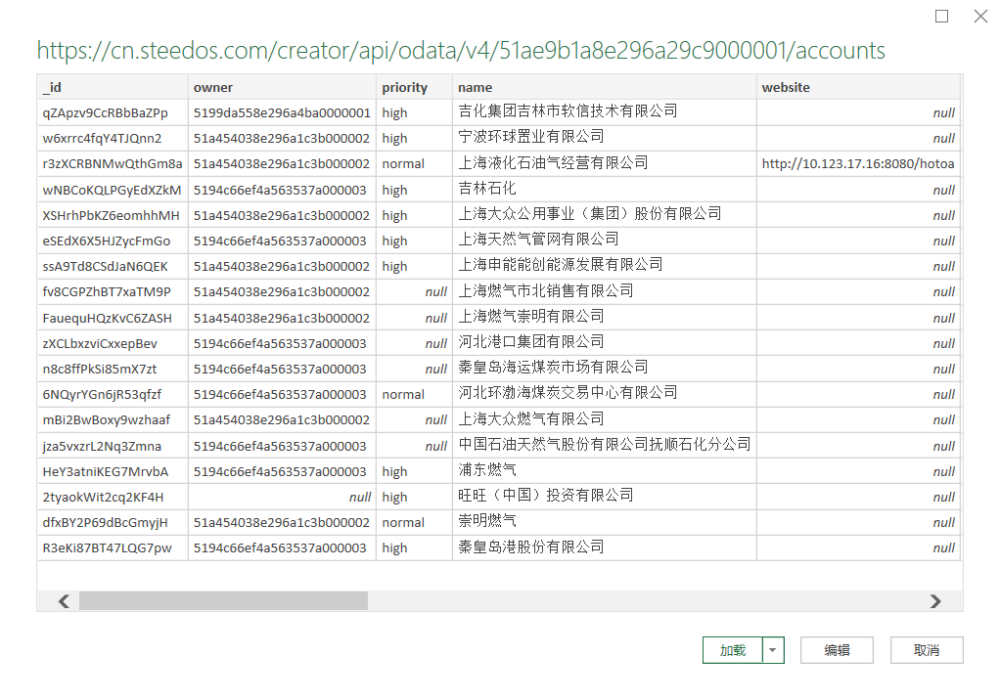

Excel 客户端
===

Creator 中定义的业务数据都可以通过Excel进行访问，将业务数据与Excel建立远程连接。建立连接后，即可利用Excel强大的计算与统计功能，进行数据分析。当远程数据发生变化时，只需要打开Excel文件，点击刷新按钮即可获取最新数据。

与传统的报表软件直接连接数据库查询所有数据不同，Excel客户端在连接Creator时需要用户输入身份信息，Creator会对业务数据进行严格过滤，确保用户只能在权限范围内查询数据。因此，每一位最终用户都可以充分利用Excel进行数据汇总和分析，而不需拜托系统管理员进行报表设计。

备注：对于Excel 2013及更早版本，需要先[下载安装微软Power Query工具](https://www.microsoft.com/zh-CN/download/details.aspx?id=39379)才能在Excel中连接远程数据。

### 建立数据连接
- 在对象管理界面，点开想要查询的对象，点击“复制OData网址”
- 打开Excel，Power Query, 从其他源，选择从OData数据源
- 在弹出的OData数据源对话框中选择“基本”，将该网址粘贴为URL
- 在弹出的用户验证窗口中选择基本验证，输入用户名和密码
- Excel弹出数据预览窗口，点击加载。

### 扩展字段
对于引用类型的字段，可以扩展字段获得对应记录中的详细信息。例如对于合同的客户，可以扩展客户ID字段，获取客户的名称、电话等详细信息。
- 点击查询，编辑查询
- 可扩展的字段以“_expand”结尾
- 点击需要扩展的字段标题
- 选择需要扩展的字段名，点确定

### 统计分析
数据与Excel建立连接后，和传统Excel录入的数据并没有区别。您可以充分利用Excel强大的功能，利用这些数据进行筛选、公式计算、制作二维表、图表。

### 数据刷新
每次打开Excel后，您只需要点击“数据”-“全部刷新”，Excel会自动重连Creator服务，为您获取最新数据。而您之前配置的各种统计报表也会自动刷新为最新的数据。