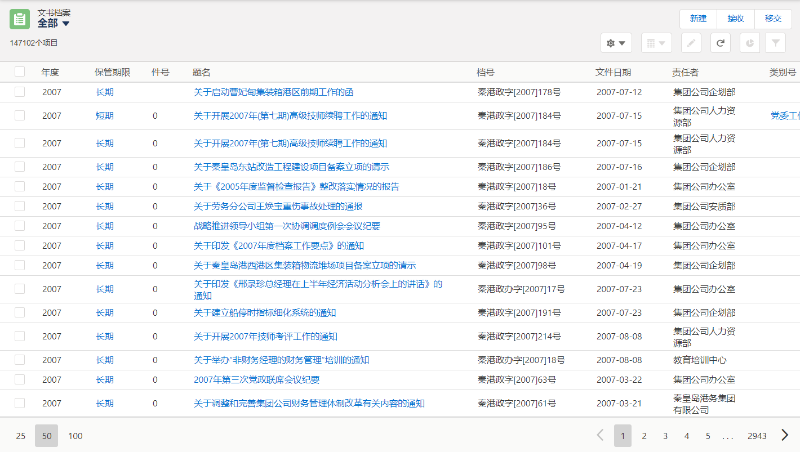

列表视图
===

列表视图用来过滤和浏览对象中的数据，每个对象可以定义多个列表视图。
- 所有数据经过系统内部权限控制机制过滤，每个用户只能查看权限范围内的数据。
- 在列表视图中选中指定的字段可以快速编辑；
- 选中多条记录，可以批量修改和删除；
- 管理员可以预定义列表视图；
- 可设定数据的过滤条件；
- 可设定数据排序方式；
- 可设定视图中显示的列，以及每列的先后顺序；
- 可以动态调整每列的宽度；
- 最终用户也可以按照自己的需求自定义列表视图。

最近查看视图
- 系统自动生成最近查看视图，按照用户的点击顺序显示最近访问过的记录清单

