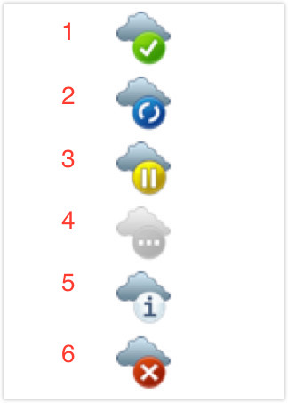
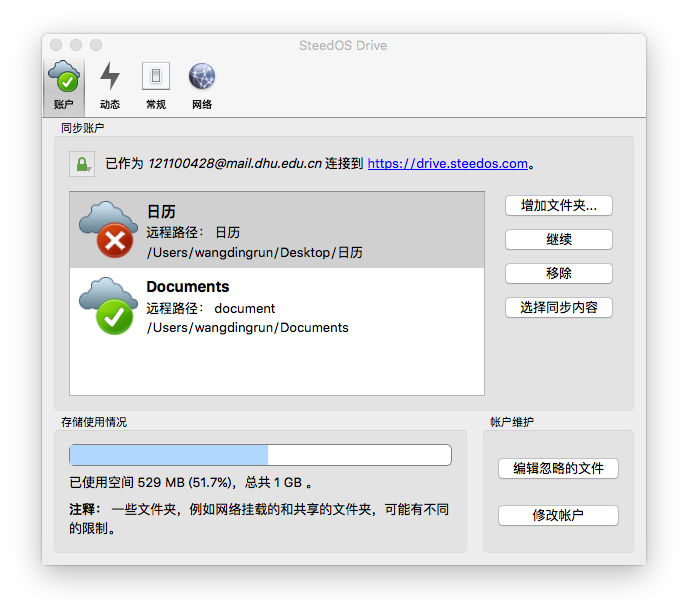
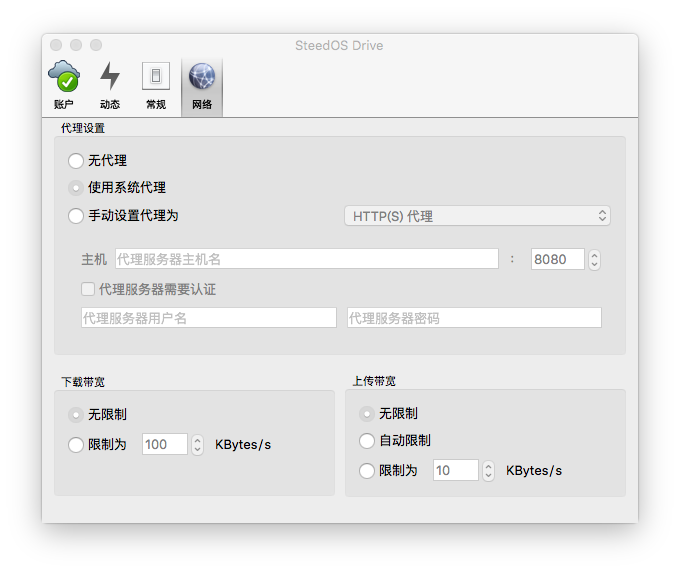

# 华炎云盘桌面客户端
华炎云盘是一款深受公司员工喜爱的文件备份、共享的软件。华炎云盘为Windows系统、Mac OS系统提供了同步客户端。华炎云盘具有以下特点：
- **实时自动地保持同步**。无论您身何时处何地,都可指定一个或多个本地文件夹,与华炎云盘服务器保持同步。
- **使操作更加简便**。华炎云电脑客户端能够让用户直接在本地的资源管理器上操作文件，从而省去了打开Web浏览器，才能使用华炎云盘的麻烦。

## 如何下载并安装客户端
1. 在华炎云官网的[“下载客户端”](https://www.steedos.com/cn/drive/downloads/)页面上，下载Windows / Mac 客户端。
1. 然后双击安装包以运行安装；
1. 之后依照安装向导来操作。安装完毕之后，同步客户端将自动保持更新。

#### 现基于Mac系统，为您演示从配置选择到账户设置，到完成安装的全过程：
1. 从[“下载客户端”](https://www.steedos.com/cn/drive/downloads/)页面下载安装完毕后，双击运行，在服务器地址框内输入https://cn.steedos.com/drive/.
  - 如果您使用的是私有云，请询问您的管理员以获得相应的服务器地址、用户名和密码。
1. 输入您的用户名和密码。
  - 如果您使用的是公有云，登录[华炎云盘官网](https://cn.steedos.com/drive/)，进行注册。注册完成后再输入用户名与密码。
1. 选择本地的文件夹路径。点击“本地文件夹”，进入后即可选择一个本地文件夹并将其指定为与华炎云盘同步的文件夹。点击“选择同步的文件”，则可以选择需要同步的文件。勾选需要同步的文件夹，点击“OK”回到刚才的页面。
2. 点击“连接”按钮完成文件夹配置。您可以分别点击“在浏览器中打开Steedos Drive”进入浏览器访问华炎云盘，也可以点击 “打开本地文件夹”进入查看本地文件夹。
3. 点击“完成”即完成安装和配置。

## 如何使用电脑客户端

安装完成并配置好客户端后，您就可以在资源管理器中对华炎云盘中的您的文件进行操作，通过客户端进行实时同步。

### 状态通知
华炎云盘的图标会隐藏在在系统的状态栏上。状态指示图标使用的是一种叠加图标，表明您的客户端当前的同步状态。

  1. 该图标表示您的客户端已连接到华炎云盘服务器
  2. 该图标表示您的客户端正在与华炎云盘服务器同步
  3. 该图标表示您的客户端与华炎云盘服务器的同步被暂停
  4. 该图标表示您的客户端未连接到华炎云盘服务器
  5. 该图标为消息提示图标，情点击它查看消息
  6. 该图标表示组态错误，例如连接服务器的URL有误，或是登入出错

### 账户设置
在“账户”下，您可以管理你想要同步的文件或文件夹、更改您的账号设置、暂停或重启同步。

#### “增加文件夹”：
表示添加新的本地的文件夹，并将其对应到华炎云盘的某个文件夹进行同步。
- 备注：
  - 华炎云盘默认同步的是华炎云盘服务器的根文件夹。如果您希望同步的是某个特定的文件夹，而不是根文件夹，那么您必须先“移除”这个根文件夹，然后再添加特定的文件夹。
  - 一个远程目标文件夹（即华炎云盘服务器上的文件夹）只能对应于一个本地文件夹。若您已同步根文件夹，则将无法同步其他的文件夹。

####  “暂停”：
暂停此文件夹的同步；

#### “移除”：
则已选文件的同步会停止，客户端中的文件不会被删除。当您只想同步某些文件夹时，您可以选中其他的正在等待同步的文件夹，点击“移除”即可。

####  “编辑忽略的文件”：
被选中的文件或文件夹不会被同步；

#### “修改账户”：
可修改服务器地址、登录的用户名与密码。

### 动态设置
 “动态”窗口，显示本账号最近的同步活动（上传、下载）信息。 
- 直接点击华炎云盘设置窗口的“动态”；
- 在华炎云盘桌面客户端菜单栏上点击选择“最近修改”。

对于操作失败的文件，点击左下方的“重试同步” 即可手动执行同步操作。

### 常规设置
“常规”窗口，可对一些常规选项进行设置。
 包括：在系统启动时启动、显示桌面提醒、选择单色图标。

### 网络设置

网络设置窗口可以设置您的网络代理，也可以限制上传与下载的宽带速度。

#### 网络代理设置
- 无代理：表示不使用代理；
- 使用系统代理：该选项为默认设置，即遵循系统代理设置；
- 手动设置代理为：您可以在该选项框内输入代理服务器主机名。
- 代理服务器需要认证：该选项表示是否选择代理服务器认证。当选择不需要认证时，代理服务器必须被设置为允许匿名使用；当选择需要认证时，代理服务器需要录入用户名和密码。

#### 流量速度设置
您可以设置华炎云盘客户端使用的流量速度。
- 下载宽带区域：
  - 无限制: 该选项为默认选项，即从服务器下载数据至客户端没有速度限制；
  - 限制为< >KBytes/s: 限制您的最大下载速度。
- 上传宽带区域：
  - 无限制：该选项为默认选项，即从客户端上传数据至服务器没有速度限制；
  - 自动限制：选择此选项，则华炎云盘客户端将会与其他应用一同分享带宽；
  - 限制为< >KBytes/s: 限制您的最大上传速度。

