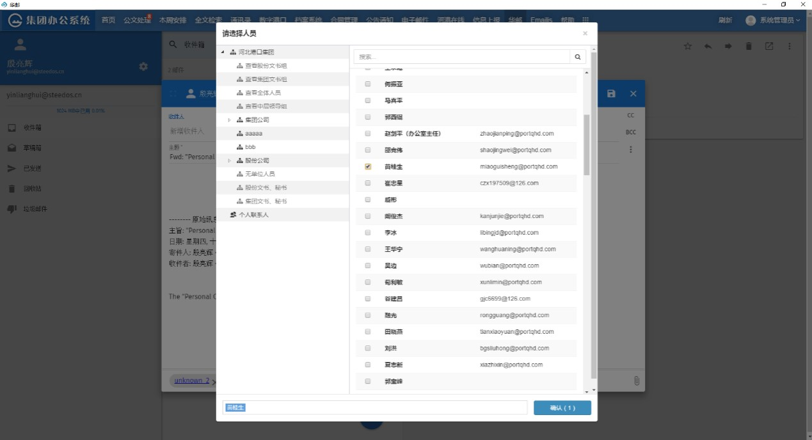

## 单点登录

可实现华炎办公系统到邮件系统的单点登录。领导不必重复输入邮件密码。

## 门户集成

可以在门户中查看未读邮件，点击邮件标题可以直接进入系统处理邮件。

## 组织架构选人

和办公自动化系统集成后，撰写邮件时点击收件人，抄送和密送会弹出组织架构

直接勾选需要的人员，可在多个部门之间切换选择多人。

## 附件在线预览

在办公自动化系统的客户端中，无需下载附件后才能查看，可实现附件的直接在线预览。常见的支持格式包括：

	Office文档

	PDF

	图片文档

