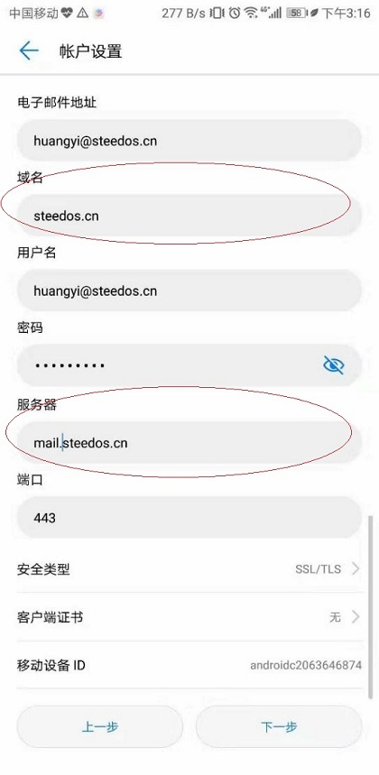
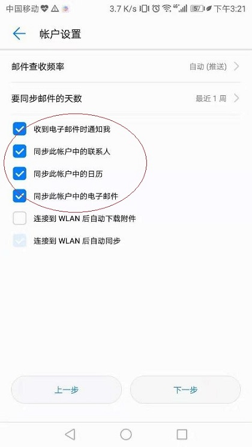

## 如何在安卓手机的邮件App里配置华邮邮箱？

在华为移动设备中，邮件的具体配置如下：

在华为设备中，进入“邮件”应用，选择“Exchange”。

   
 
 输入“电子邮件地址”、“用户名”、“密码”后点击“登陆”。

   
 
 在账户设置页面填写：  
 域名：steedos.cn 
 服务器：mail.steedos.cn,完成后点击“下一步“。
 
 

选择邮件查收频率、邮件同步天数，并需要按图进行勾选。

设置完成后，即邮箱添加成功，即可进入收件箱。

