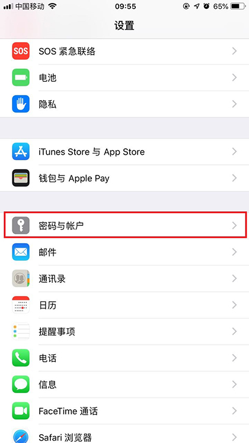
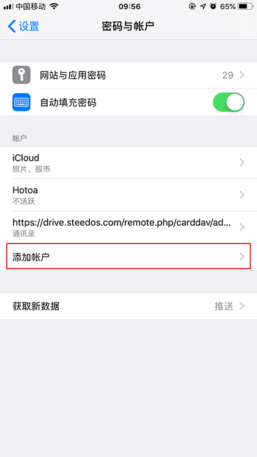
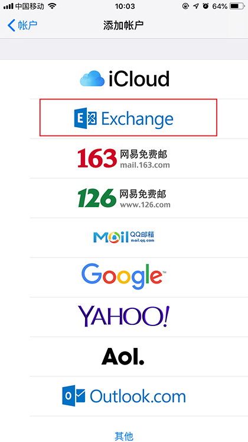
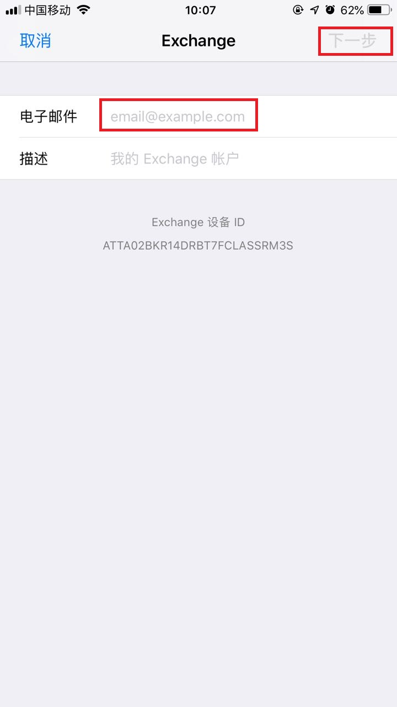
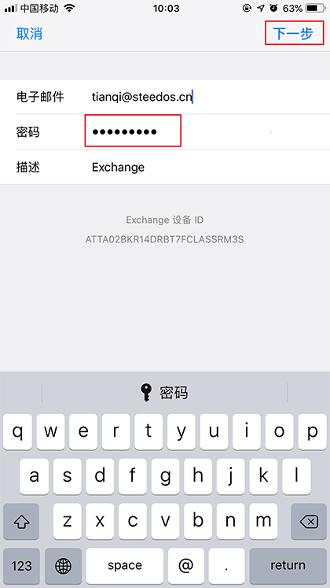
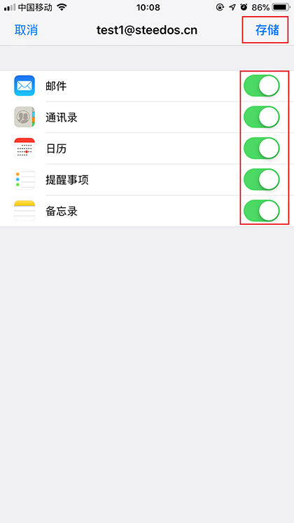
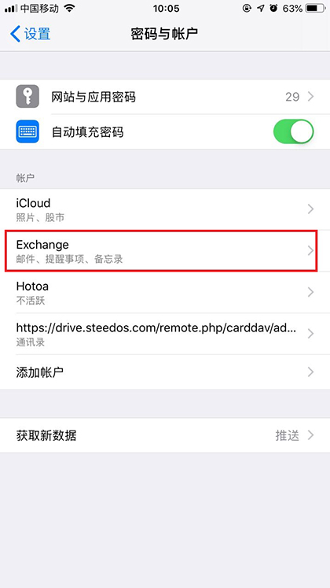

## 如何在苹果手机的邮件App里配置华邮邮箱？

随着移动办公需求的增加，邮件的及时性尤为重要，华炎邮件系统也可以通过设置直接在苹果设备中进行使用。

### 1. 设置

在苹果手机或平板，进入“设置”应用，

   

 选择“密码与账户”，

   

 点击“添加账户”。

   

 选择“Exchange”，

   

 输入电子邮件地址后点击“下一步”，

   

 随后点击“手动配置”。

   

 输入密码后，点击“下一步”，

 

 开启邮箱、提醒事项、备忘录和日历按钮，点击“存储”后添加Exchange邮箱成功。

 

