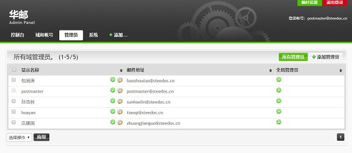

## 如何设置华邮邮箱？

华炎邮件系统的管理员，可以在系统的设置界面进行以下操作： 添加/维护邮件域、添加/维护邮件用户、维护管理员名单、查看操作日志。

## 登录

在浏览器的地址栏中输入邮件系统地址https://mail.steedos.cn/admin 。在本邮件系统部署到您的企业后，这里输入的就是您企业邮箱的网址。

   
 
填写入用户名、密码后可以进入系统。
 
   

进入华炎邮件控制台后，能看到基本的系统信息，包括主机名、已运行时间、服务器负载和网络信息。
 
 ## 邮件域管理
 
在华炎邮件系统中您可以使用多个邮件域，在域和账号页面中可以看到所有管理的域信息
 

 
点击“添加域”可以增加邮件域，输入域名和公司名点击“添加”即可
 

  
点击可以对已添加的域进行启用或禁用设置，也可以修改公司名
  
 ## 用户管理
   
点击邮件域中的用户数，可以查看到此邮件域中的所有用户
   

    
带有绿色勾的表示未已启用的账号，点击设置按钮可以对，可以管理用户的账号启用状态，是否为邮件管理员，还可以修改用户的显示名和邮件的可使用空间
    

    
点击“密码”可以重置用户的邮件系统登陆密码，出于对安全性的考虑用户密码不能少于8位
    

    
点击，进行邮件账号的添加
    

    
## 邮件管理员

在“管理员”页面可以查看到邮件系统的所有管理员。

带有绿色勾的表示未已启用，点击设置按钮可以对，可以管理用户的账号启用状态，是否为邮件管理员，还可以修改用户的显示名和邮件的可使用空间。
点击，可以在系统中增加一个用户并赋予此用户管理员权限，添加方式同添加一般用户，但建议直接将用户标记为管理员而不是创建独立的管理员帐号。

## 系统日志

在管理页中可以看到系统的操作日志，包括了：管理员登陆、禁用账号操作、添加账户操作等的日志

