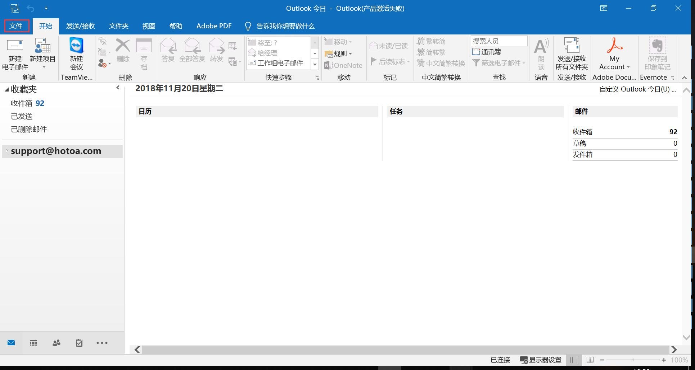
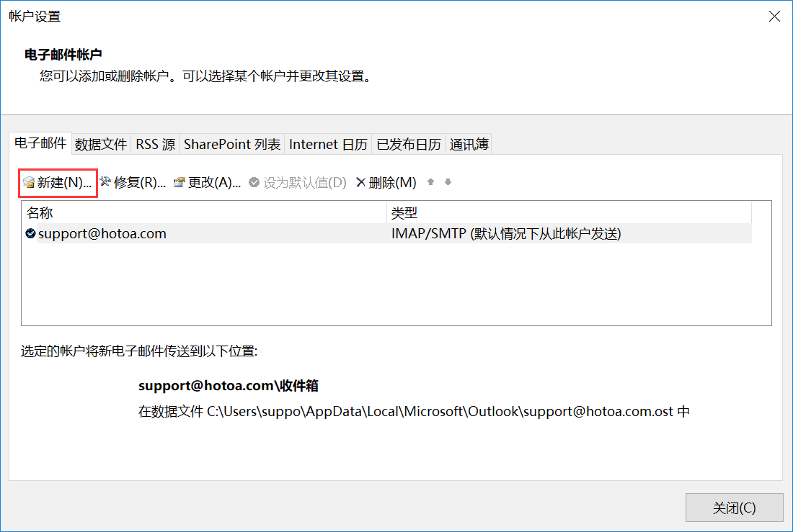
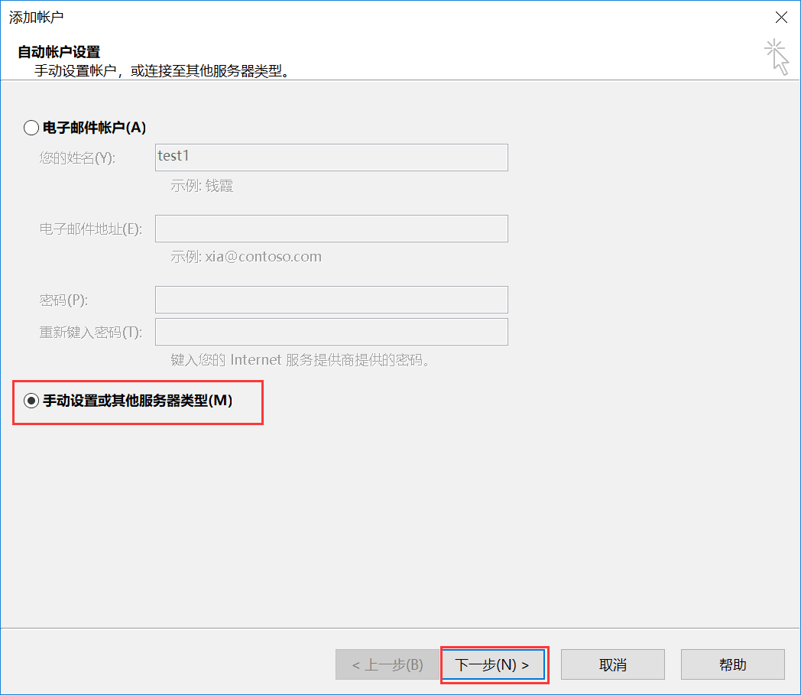
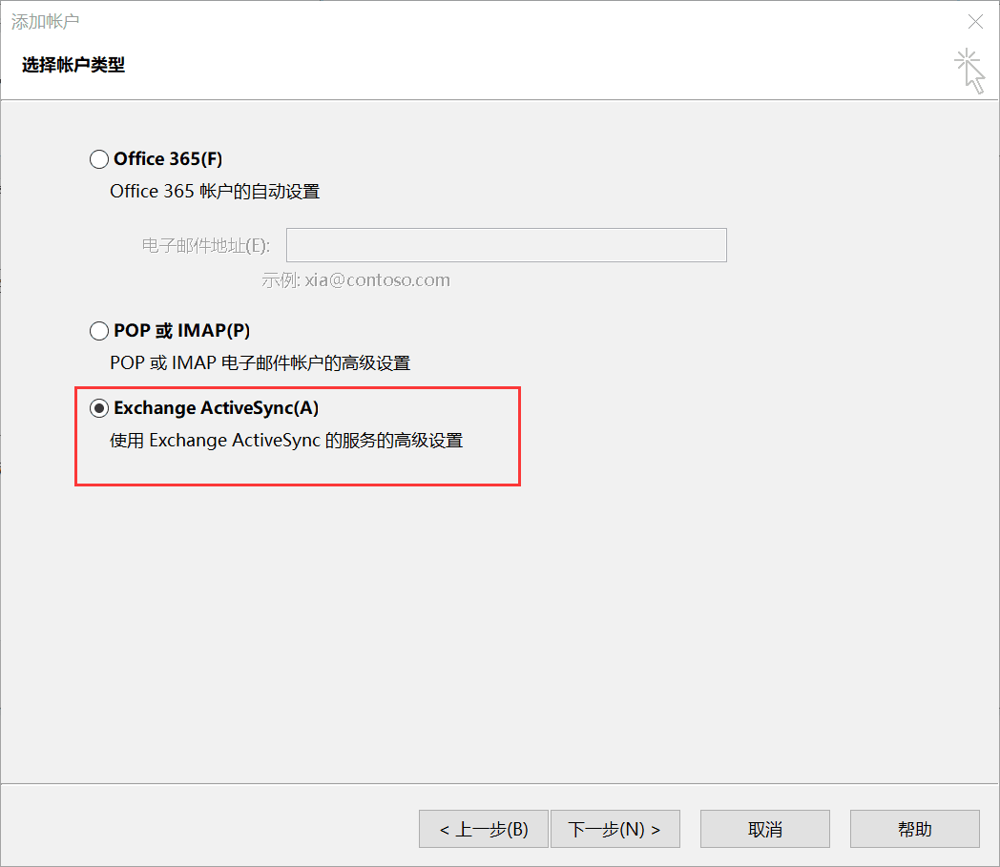
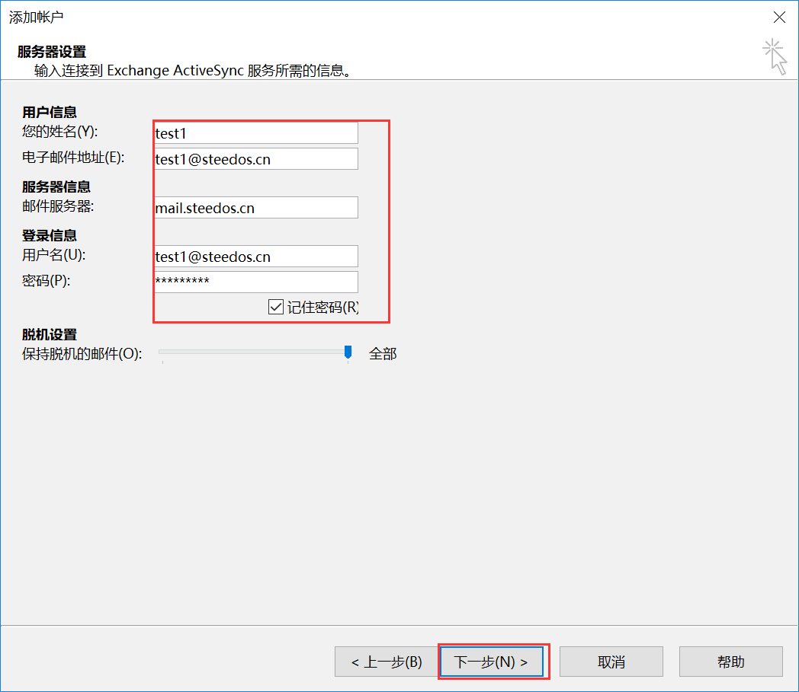
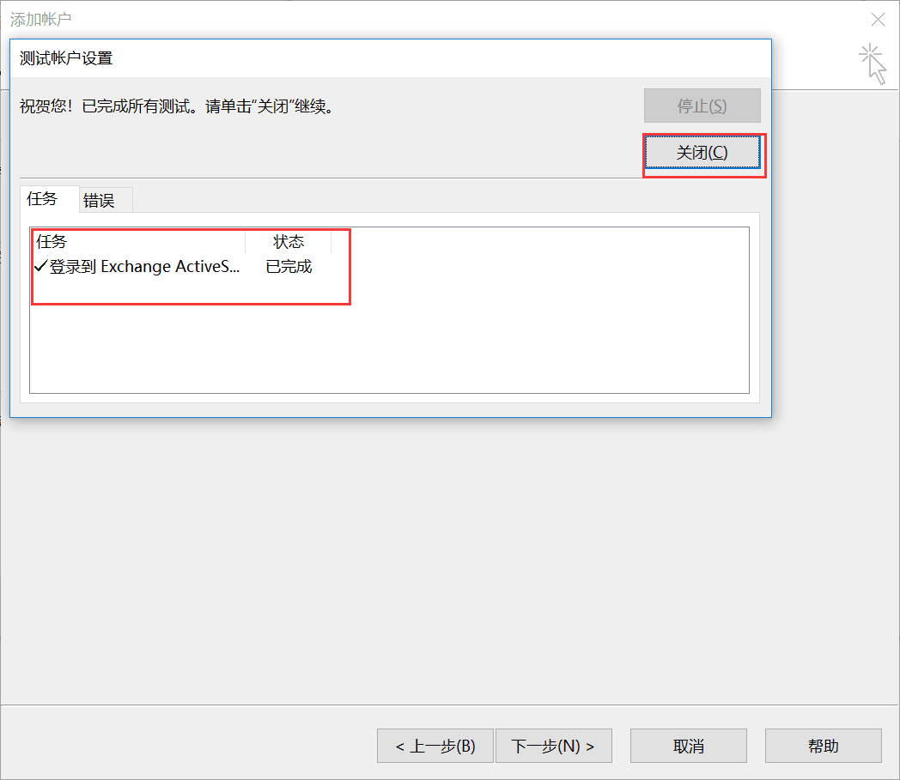
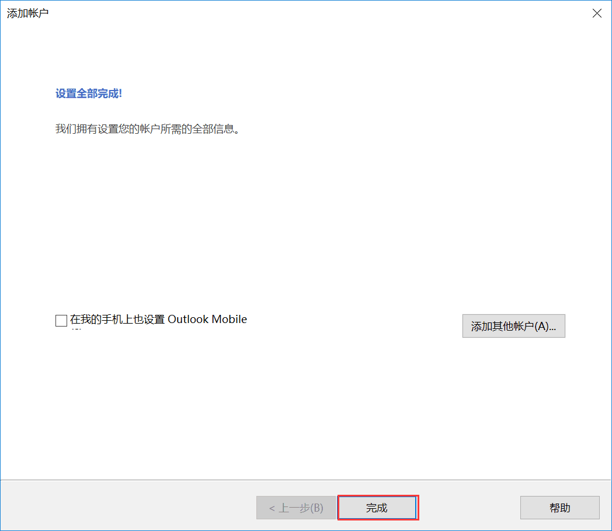
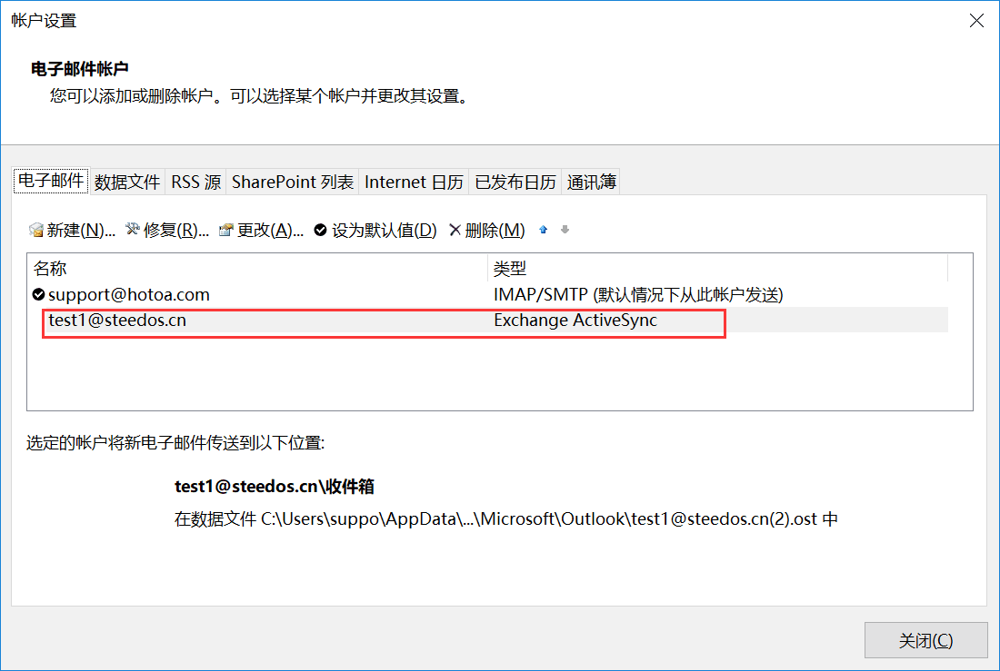
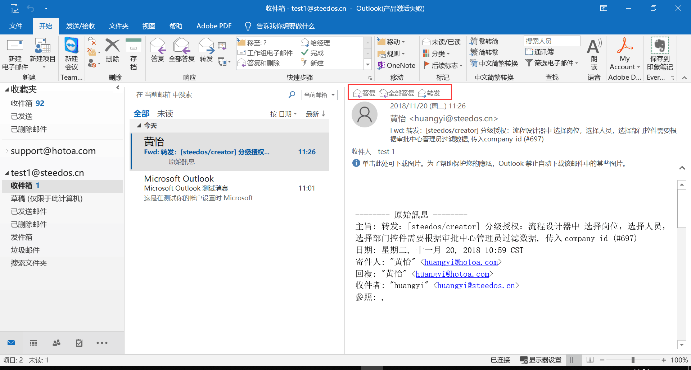

## 如何在Outlook里配置华邮邮箱？

在PC机上，Outlook作为常用的邮件客户端，也可以和华炎邮件系统进行对接，实现邮件的收发。

电子邮箱账户的设置如下：

### 进入Outlook,选择“文件”选项卡。

	 

### 在“信息”项中，点击“账户设置”，选择“管理配置文件”。

	 

### 在邮件设置页中点击“电子邮件账户”。

	 

### 在账户设置中点击“新建(N)...”。

	 

### 选择“手工设置或其他服务器类型”后点击“下一步”。

	 

### 选择“Exchange ActiveSync(A)”后点击“下一步”。

	 

### 进行邮件服务器设置，输入包括用户信息、服务器信息、登陆信息。

	 

### 账户测试通过后点击“关闭”。

	 

### 设置全部完成后，点击“完成”，可以看到添加账户已成功。

	 

	 

### 完成后就可以在Outlook中使用邮箱。

	 
