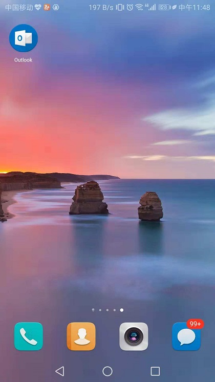
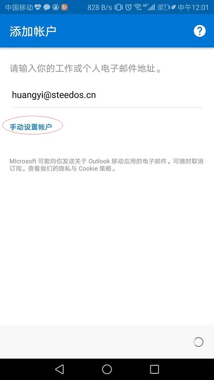
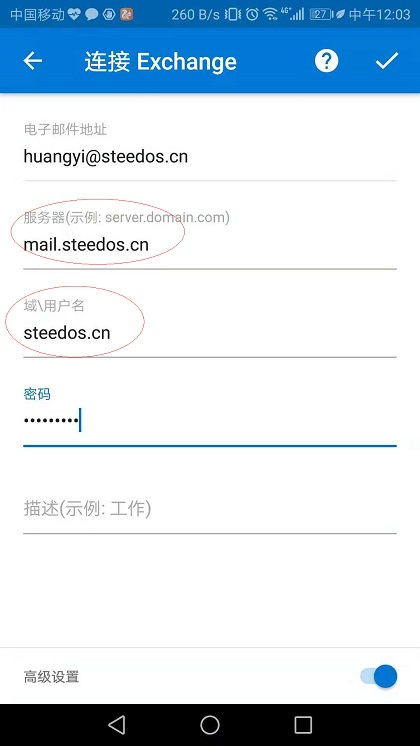
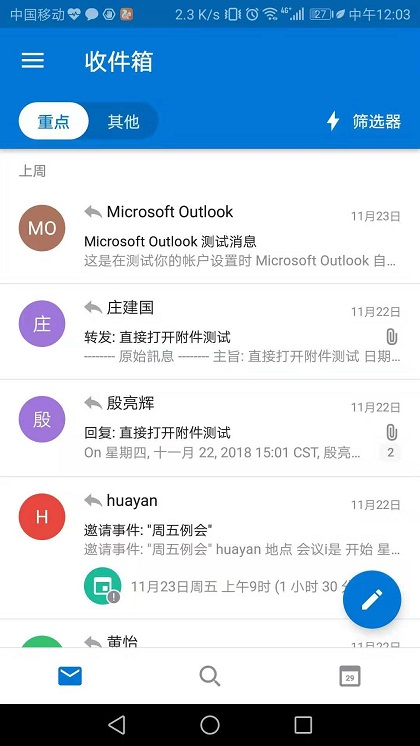

## 如何手机的Outlook里配置华邮邮箱？

在手机或其他移动端中使用Outlook APP也可以收发华邮的邮件，具体设置过程如下：

在手机端安装outlook App,可以从应用市场中搜索后安装。

  
 
 进入outlook App，输入需要添加的邮箱后点击“继续”，随后点击“手工设置”
 
  
 
 此时需点击“高级”并将服务器信息 mail.steedos.cn 和域名 steedos.cn输入
 
   
  
  完成后系统会询问是否需要再添加一个账户，如无此需求点击“跳过”后就会进入收件箱页面。
  
   
