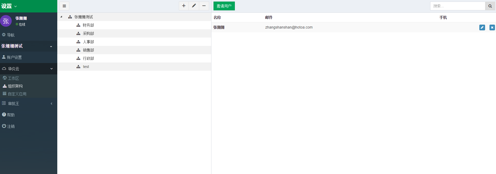

## 设置组织架构：人员
  管理员添加完部门之后，继续添加人员账号。
  
  在添加人员时可以把人员放置在所属的部门中，设置用户的直属上级和用户状态。当用户状态是“有效”时可正常使用，如需要暂停使用此人员账户时可设置为无效。

   
#### 邀请用户
- 进入“设置”，再点击“华炎云”后，点击“组织架构”，再点击“邀请用户”按钮。

- 输入新用户的邮件地址，多个邮件地址之间请用换行相隔。
- 点击“确认”按钮，系统将发送激活邮件到该用户的信箱，新用户通过点击激活链接设置密码、登录审批王。

备注：新增人员账号时，默认是有效账号，如果要对该账户停用的话，取消选择有效即可。

#### 编辑人员
进入人员列表页面，点击右侧的“编辑”按钮，修改人员的姓名、选择所属部门、指定直属上级（直属上级的设置与流程设计中的节点属性相关）。

备注：审批王支持一个用户属于多个部门。

#### 删除人员
- 进入人员列表页面，点击右侧的“X”按钮，对该账号进行删除。
- 如是暂时停止使用此人员账号，可到人员编辑页面将账号状态设置为无效。

