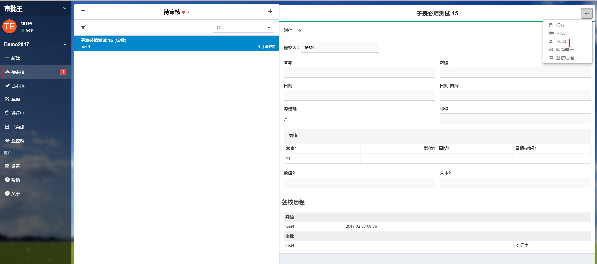
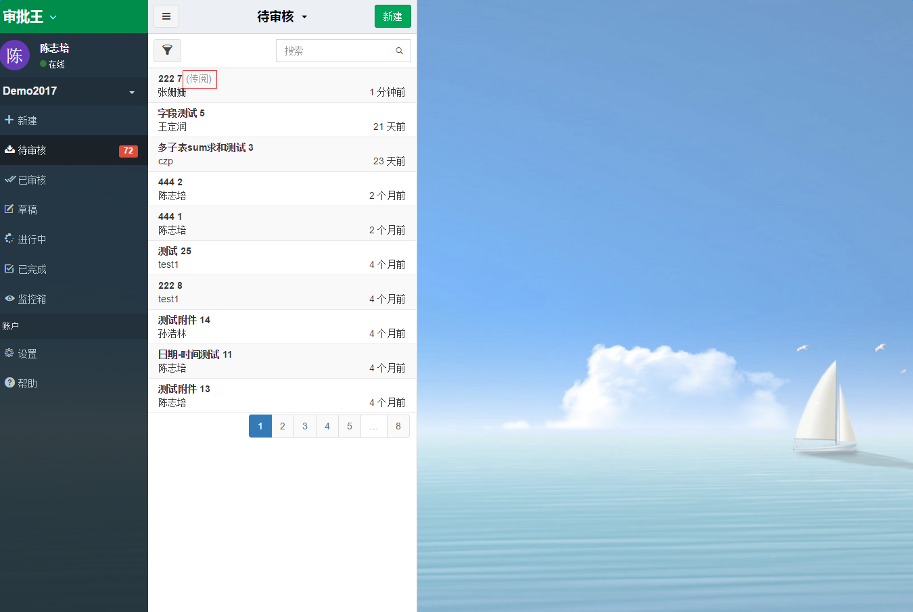

## 传阅文件

  传阅文件是指在审批文件时，将待审核的文件分发给其他人查看。收件者能在“待审核”中查看文件，并签署意见。分发者审批完文件后，文件继续往下一步流转。即便此流程已先行流传完成并归档，收件者仍然能够查看文件。
  
 - 在“待审核”中，选择需要传阅的文件，点击表单右上角按钮后，出现传阅按钮。
 
 
 - 选择一个或多个收件者，该文件将会出现在收件者的“待审核”文件列表中，并标以“传阅”二字。
  
  
 - 收件者可以对文件填写自己的意见，系统会自动记录下意见，并在签核历程中显示。
 
 - 当前处理人（分发者）审批完文件后，文件继续向下流转，收件者是否已查看文件并不影响该文件的正常流转。
