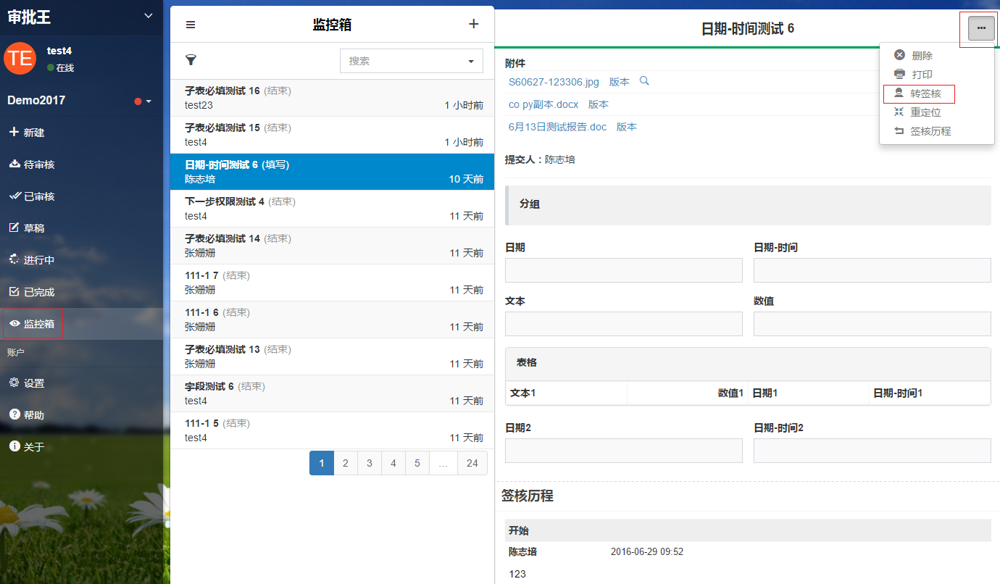
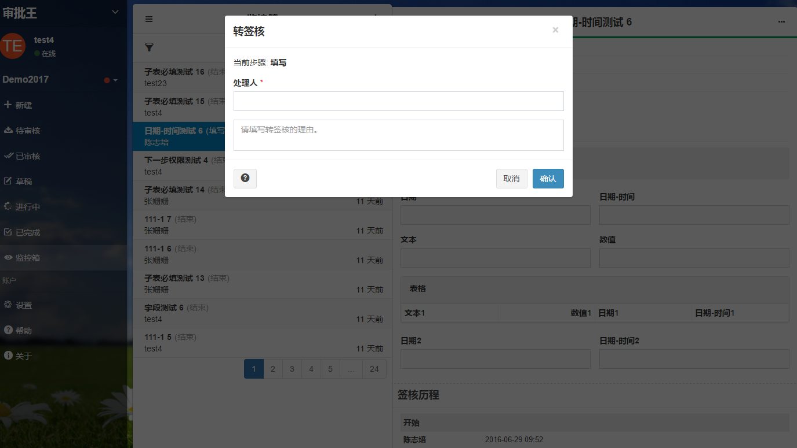

## 转签核

转签核是指同一审批步骤改变审批人员。当申请单长时间无人审批或一直停留在某一步骤时，您可以联系流程管理员进行转签核的操作，通过其他人员来审批您的文件，让文件继续流转。

是流程管理员和工作区管理员才有权限进行的操作。

具体的操作流程如下：

- 进入工作区。点击“监控箱”，进入监控箱界面。

- 点击左上侧漏斗形图标可按流程分类，选择相应流程。

- 点击需要操作的申请单，再点击该申请单右上角的按钮后，出现转签核按钮。

- 重新选择当前步骤处理人，填写相应的转签核的理由。

- 最后点击“确认”。

执行完“转签核”，这个文件就会被系统发给指定的处理人，他可以在“待审核”列表中看到这张申请单。该申请单的“签核历程”也会有相应的记录。
