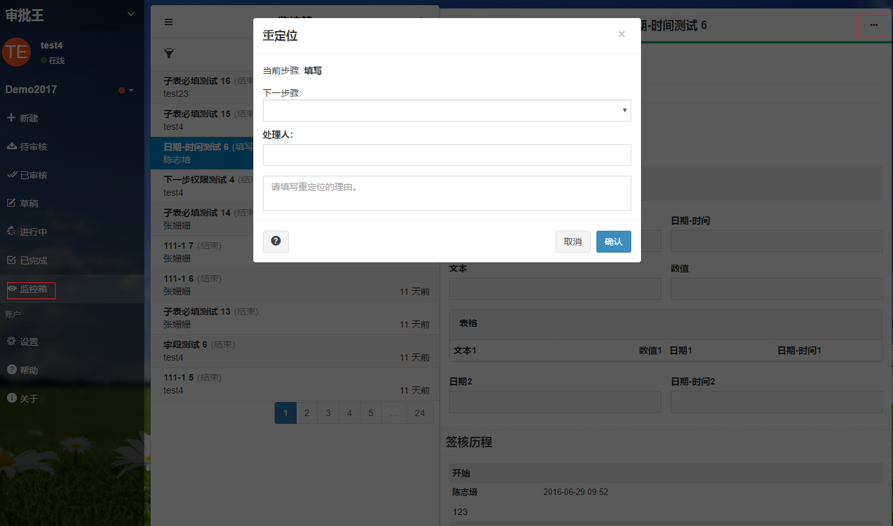
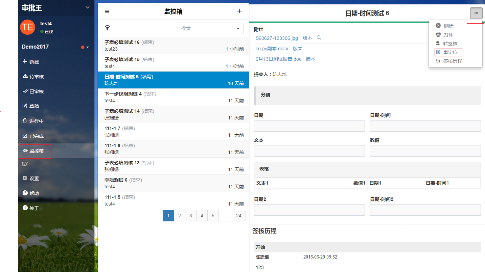

## 关联文件
关联文件是将已提交的审批单文件关联到新建的审批单中，以便后续的审批处理人查看到关联到该审批单中的文件；

例如：新建的审批单是“出差费用报销单”，可以关联与此次费用报销相关的"出差申请单"，这样的话，领导在审批“出差费用报销单”时，就可以查看到是报销哪次出差产生的费用；

具体的操作流程如下：
- 进入工作区，点击“填写表单”；

- 点击表单填写界面的顶部的“关联文件”按钮，或者右上角的省略号按钮下的“关联文件”按钮，就会跳出“关联文件”的弹出框；

- 在关联文件的弹出框中输入要关联的文件的名称，可以是多个；
- 点击“确认”即可。

#### 备注
- 关联的文件必须是已经提交过的审批单；
- 只有在新建审批单时才能关联文件；
