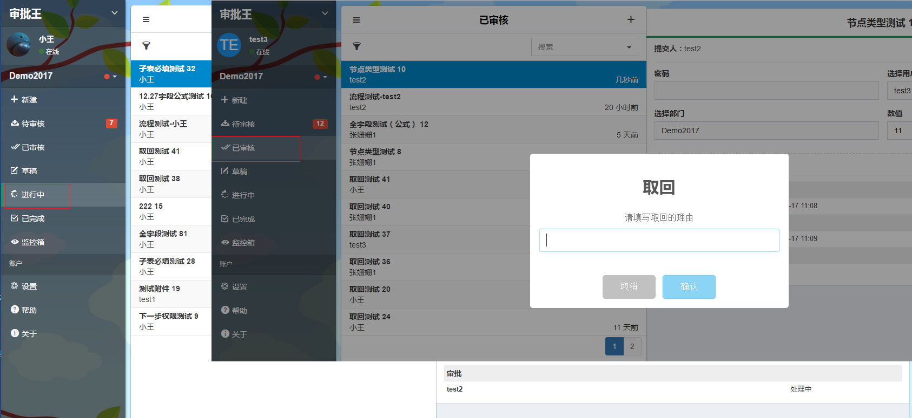

## 流程图
流程图对应的是该审批单的的流转过程；

每个流程图都是从“开始”，到“审批”，最后“结束”，其中“审批”可以包括多个审批过程；

具体的操作流程如下：
- 当取回新提交的申请单时（注意：该申请单还没有被下一步处理人审批过），需要在提交人的“进行中”找到该申请单。

- 当审批人想取回刚审批过的申请单时（注意：该申请单还没有被下一步处理人审批过，或下一步骤不是结束步骤），需要在"已审核"中找到该申请单。

- 点击找到的申请单后，再点击申请单右上角的按钮，再点击“取回”按钮，就会跳出需要填写取回理由的弹出框，点击弹出框的“确认”按钮后，该申请单就会出现在取回操作的处理人的“待审核”里,找到该申请单后，就可以重新处理该申请单。。

#### 备注
- 该申请单的“签核历程”也会有相应的记录。
