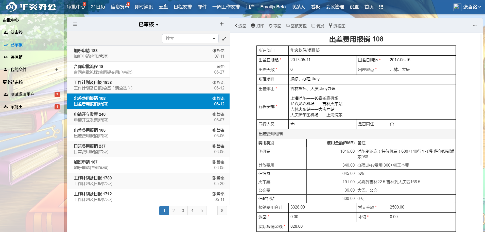


###主界面
登录系统->审批中心，在主界面窗口，左侧是申请单分类，右侧是选中分类下的申请单列表。
申请单分类如下：

- 待审核：包含所有需要您处理而您又没有处理的申请单。
- 已审核 : 包含所有您已经处理过的申请单。
- 监控箱：包含所有您有权限监控管理的申请单。

我的申请单：由您拟写的申请单，具体又分为：“填写表单”，“草稿”，“进行中”，“已完成”。

- 填写表单：详情见下文下文“填单->拟写”。
- 草稿：新拟写但是未提交的申请单存储在草稿箱里。
- 进行中：已经提交了，但是还在审批中的申请单。
- 已完成：已经提交且审核完成的申请单。

 
