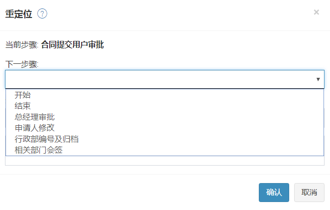


### 重定位
重定位即跳过当前的步骤，使申请单从流程中任意步骤(非当前步骤)开始流转。如有此需要时，您可以联系流程管理员进行重定位操作，定位到流程其他审批步骤，并指定新的处理人来审批您的申请单，使其继续流转下去。

- 进入审批中心，点击“监控箱”，进入监控箱界面。
- 在监控箱界面可查看到所有流转中的申请单。点击下三角图标，进入高级搜索界面，可选择查询条件进行筛选。
- 点击需要操作的申请单，再点击上方的 “重定位”按钮。
- 选择重定位步骤的及处理人。 
- 执行完“重定位”，这个申请单就会被系统发给刚才指定的处理人，并出现在其“待审核”列表中。该申请单的“签核历程”也会有相应的记录。

